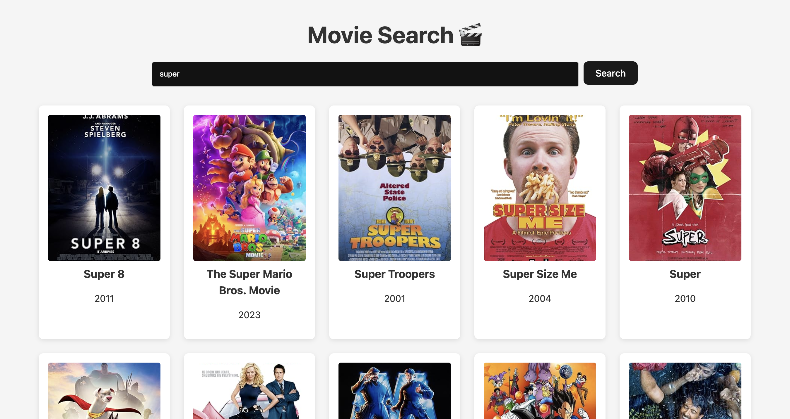

# Movie Search App

A modern, user-friendly movie search application built with React and Vite. This app allows users to search for movies using the OMDb API, view search results in a uniform grid, and click on a movie card to expand it and display additional details inline.

## Features

- **Movie Search:** Search for movies by title using the OMDb API.
- **Inline Movie Details:** Click a movie card to expand it and view extra information (Plot, Genre, IMDB Rating) directly within the card.
- **Responsive Design:** Modern and responsive layout that adapts to various screen sizes.
- **UI States:** Smooth handling of loading states, error messages, and transitions.

## Demo



## Getting Started

Follow these instructions to set up and run the project locally.

### Prerequisites

- [Node.js](https://nodejs.org/) (v14 or higher recommended)
- [npm](https://www.npmjs.com/) or [Yarn](https://yarnpkg.com/)

### Installation

1. **Clone the repository:**

   ```bash
   git clone https://github.com/your-username/movie-search-app.git
   ```

2. **Navigate to the project directory:**

   ```bash
   cd movie-search-app
   ```

3. **Install the dependencies:**

   ```bash
   npm install
   ```

### Running the App
   Start the development server with:

   ```bash
   npm run dev
   ```

   Then open http://localhost:3000 in your browser to see the app in action.

### Building for Production
   To build the app for production, run:

   ```bash
   npm run build
   ```

   Preview the production build locally with:
   ```bash
   npm run preview
   ```

## Project Structure
```bash
movie-search-app/
├── src/
│   ├── App.jsx          # Main React component for the app
│   ├── MovieDetails.jsx # Component to display detailed movie information
│   ├── App.css          # Component-specific styles
│   └── index.css        # Global styles
├── package.json         # Project configuration and dependencies
└── README.md            # Project documentation
```

## API
   This application uses the OMDb API for fetching movie data. Be sure to register for a free API key and update the API_KEY variable in your code if needed.

## Linting
   To check for code style and linting issues, run:

   ```bash
   npm run lint
   ```

## License
   This project is licensed under the MIT License. See the LICENSE file for details.

## Acknowledgments
- **React**
- **Vite**
- **OMDb API**